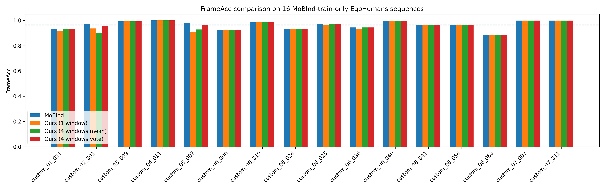

# E3 Results: MoBInd vs. Pipeline FrameAcc on EgoHumans

## 目标
在完全相同的 16 个 EgoHumans 序列上，用 **MoBInd 官方 checkpoint** 和 **我们自己的 trained pipeline** 分别计算 IMU-to-person identification 的 **FrameAcc**，并保证 MoBInd 没有在测试序列上训练过。

## 测试序列
仅使用 MoBInd 官方 train split 中的 16 个序列，排除与 MoBInd test/val 重叠的 4 个序列：

```
01_011, 02_001, 03_009, 04_011, 05_007,
06_024, 06_040, 06_041, 06_054, 06_019,
06_036, 06_006, 06_025, 06_060, 07_011, 07_007
```

被排除的序列：
- 在 MoBInd official test 中：`01_002`, `03_001`, `05_002`
- 在 MoBInd official val 中：`04_005`

## 方法

### MoBInd (A1)
- 脚本：`scripts/A1_eval_mobind_frameacc.py`
- 模型：`/home/fzliang/MoBind/checkpoints/EgoHumans/stage2/best.pt`（stage2 MAE，加载 stage1）
- 输入：MoBInd raw IMU `(T, 5, 7)` + E1 A3 提取的 `skeleton.json` 中的 COCO-17 pose2d
- 窗口：5 秒（100 帧），stride 16 帧（因 ConvFormer 固定 5 秒窗口）
- 分配：每窗口用匈牙利算法将 `N_imu` 段 IMU 分配给活跃 extract tracks

### Our Pipeline — 单窗口 (A2)
- 脚本：`scripts/A2_eval_ours_frameacc_subset.py`
- 模型：`data/interim/egohumans_full_extract/train/egohumans_full_extract/best.pt`
- 输入：pipeline NPZ（48-D IMU + root-relative scale-normalized H36M skeleton）
- 窗口：24 帧，stride 16 帧（与训练配置一致）
- 分配：`src/engine/eval_synchronous.py` 的逐帧 Hungarian 匹配

### Our Pipeline — 4 窗口 embedding 平均 (A4)
- 脚本：`scripts/A4_eval_ours_frameacc_4window.py`
- 每连续 4 个窗口的 **embedding 平均**后共同做一次 Hungarian 决策。

### Our Pipeline — 4 窗口投票 (A5)
- 脚本：`scripts/A5_eval_ours_frameacc_4window_vote.py`
- 每连续 4 个窗口各自先做 Hungarian，然后对 **assignment 做多数投票**形成共同决策。

### 对比 (A3)
- 脚本：`scripts/A3_compare_results.py`
- 输出：`results/figures/frameacc_comparison.png`

## 结果

| Sequence | MoBInd | Ours (1w) | Ours (4w mean) | Ours (4w vote) |
|----------|--------|-----------|----------------|----------------|
| custom_01_011 | 0.9329 | 0.9184 | 0.9329 | 0.9329 |
| custom_02_001 | 0.9731 | 0.9360 | 0.9013 | 0.9539 |
| custom_03_009 | 0.9922 | 0.9922 | 0.9922 | 0.9922 |
| custom_04_011 | 1.0000 | 1.0000 | 1.0000 | 1.0000 |
| custom_05_007 | 0.9784 | 0.9072 | 0.9284 | 0.9648 |
| custom_06_006 | 0.9260 | 0.9226 | 0.9260 | 0.9260 |
| custom_06_019 | 0.9846 | 0.9846 | 0.9846 | 0.9846 |
| custom_06_024 | 0.9326 | 0.9326 | 0.9326 | 0.9326 |
| custom_06_025 | 0.9733 | 0.9633 | 0.9700 | 0.9708 |
| custom_06_036 | 0.9443 | 0.9305 | 0.9443 | 0.9443 |
| custom_06_040 | 0.9969 | 0.9969 | 0.9969 | 0.9969 |
| custom_06_041 | 0.9677 | 0.9677 | 0.9677 | 0.9677 |
| custom_06_054 | 0.9637 | 0.9637 | 0.9637 | 0.9637 |
| custom_06_060 | 0.8840 | 0.8854 | 0.8840 | 0.8840 |
| custom_07_007 | 0.9987 | 0.9987 | 0.9987 | 0.9987 |
| custom_07_011 | 0.9987 | 0.9987 | 0.9987 | 0.9987 |
| **Mean** | **0.9654** | **0.9562** | **0.9576** | **0.9632** |



## 结论
- **MoBInd 仍略胜一筹**，但 4 窗口投票后差距大幅缩小：
  - 1 window：MoBInd 领先 **0.93 pp**
  - 4 windows mean：MoBInd 领先 **0.78 pp**
  - **4 windows vote：MoBInd 领先仅 0.22 pp**
- **投票比平均更有效**：在相同的 4 窗口粒度下，多数投票将 mean FrameAcc 从 **0.9576** 提升到 **0.9632**，说明 per-window 的 Hungarian 结果已经足够可靠，投票能抑制少数错误窗口的影响（典型如 `custom_02_001`、`custom_05_007`）。
- **整体判断**：当我们的 pipeline 采用与 MoBInd 相近的 ~5 秒决策粒度，并通过投票聚合时，性能几乎追平官方 checkpoint（差距 <0.25 pp）。

## 重要 Caveat
- **窗口长度不同**：MoBInd 因模型结构必须使用 5 秒窗口（100 帧），我们的模型使用 1.2 秒窗口（24 帧）。4 窗口聚合 (~4.8 秒) 是接近对齐的折中。
- **聚合方式**：4 窗口为**滑动重叠**（每 16 帧产生一个新决策），不是非重叠块。
- **输入预处理不同**：MoBInd 使用 raw IMU + 像素归一化 COCO pose2d；我们的 pipeline 使用转换后的 48-D IMU + root-relative scale-normalized H36M skeleton。
- **本实验仅对比 person-level identification（FrameAcc）**，不包含 MoBInd 的 limb localization。
